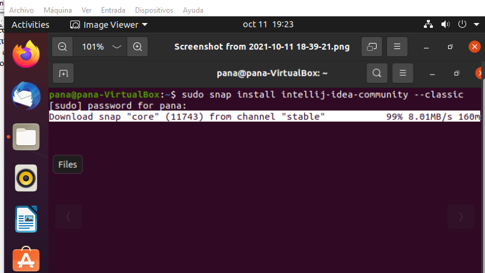

1)INSTALACION

Intellij es uno de los IDE mas populares entre los desarrolladores. Para instalarlo en nuestro equipo tenemos que realizar dos pasos muy sencillos. 
Primero debemos de comprobar que tenemos instalado Java en nuestro equipo : java -version
Segundo teclear el siguiente comando para que se instalen automáticamente las librerías preinstaladas en linux con : sudo snap install intellij-idea-community –classic
Con esto ya deberíamos tener instalado este IDE solo tenemos que lanzarlo presionando su icono.

