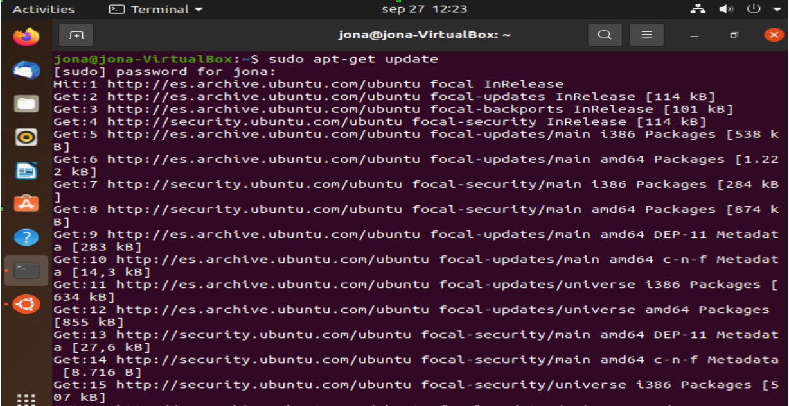

#Intalacion de la JDK.md

1 INSTALACION
-El primer paso que tenemos que llevar a cabo es actualizar el sistema
con el siguiente comando (sudo apt-get update).

-Luego instalamos openjava jdk con este comando ( sudo apt-get install default-jdk)

-Hacemos la comprobación de la versión que hemos instalado de java en ubuntu

-En mi caso he instalado la versión  11 de java, la cual no es la que queremos exactamente.
-Al intentar hacer una instalación precisa de la versión 8 de java (sudo apt install openjdk-8-jdk) y hacer la comprobación de la versión (java –versión) había un problema de incompatibilidad de versiones haciendo que el sistema me mostrara nuevamente que la versión instalada era la 11.

2 CONFIGURACIÓN DE LA VARIABLES DE ENTORNO
- Esta configuración de se tiene que aplicar debido a que cada ves que utilicemos java, ubuntu necesita saber donde esta ubicado el lenguaje java.

-Ejecutamos el siguiente comando ( ls /usr/lib/jvm)
-Editamos y modificamos el fichero profile ( nano /etc/profile)
Realizamos los siguientes cambios
 #Java version
JAVA_HOME=/usr/lib/jvm/ java-1.11.0-openJdk-amd64  
PATH=$PATH:$HOME/bin:$JAVA_HOME/bin  
export JAVA_HOME  
export JRE_HOME    
export PATH   

3 ELIMINACIONES DE VERSIONES POR PROBLEMA DE INCOMPATIBILIDAD 
-A pesar de haber configurado las variables de entorno para que funcionara correctamente la versión que quería, en este caso la 8, no conseguía ningún resultado determinado , así que proseguí a eliminar las versiones que se habían instalado de manera predeterminada y solo dejar la que me interesaba.

-Eliminando uno a uno las versiones que no me interesaban y finalmente comprobando la version de java (java –version)

