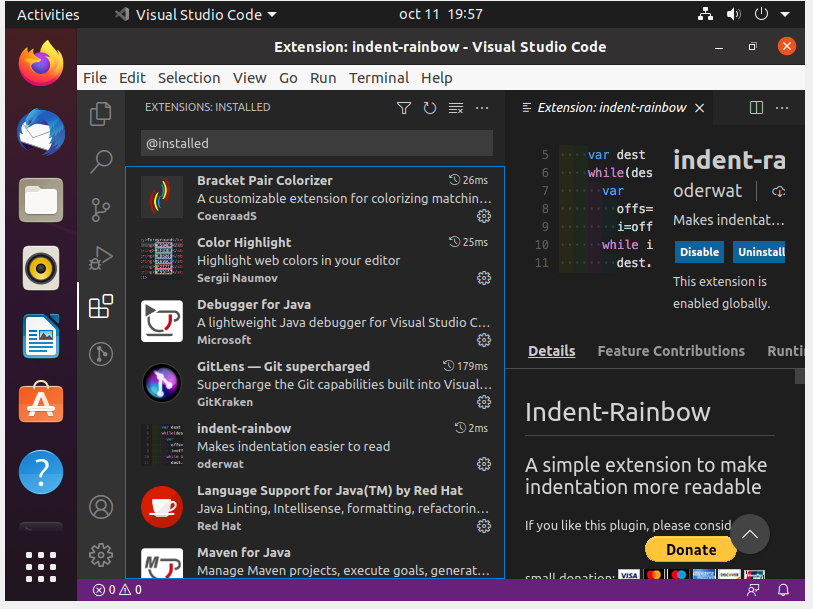

1)COMPROBAR VERSION DE JAVA 
Para esto utilizaremos el comando : java -version

2)INSTALACION MEDIANTE PAQUETE DE SOFTWARE 
Para ello utilizaremos el siguiente comando, esto permite una descarga directa y estable con Ubuntu
sudo snap install –classic code

3)INSTALACION DE EXTENSION 
Estas extensiones son muy necesarias puesto que nos hacen la vida mas fácil programando ya que o nos ahorran tiempo o nos evitan errores; aquí unas de las mas interesante e importantes: 

Language Support for Java(TM) de Red Hat 
Debugger for Java 
Java Test Runner 
Maven for Java 
Java Dependency Viewe 
Visual Studio IntelliCode 
Path Intellisense 
Bracket Pair Colorizer 
GitLens 
Prettier 
Color Higlight 
Indent Rainbow 
 
 
